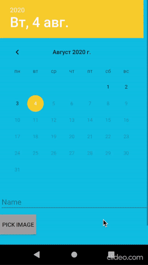
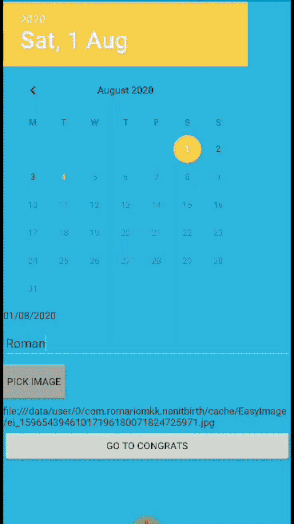

# Nanit Birthday showcase
*Kotlin 100%*

## Architecture and glue for that:
* MVVM + DataBinding
* 1st 'M' from MVVM consists of UseCases and one Storage(Repositories are redundant for such a small project)

## Libraries used:
* ktx
* Hilt for DI
* Glide with custom Loader for image depiction and caching
* NavComponent, 1 navigation level
* Timber for logging
* CircleImageView, TedPermission for smooth permission obtaining, EasyImage for image picking, Joda for some specific time entities wrangling

## Details and solutions
### Domain
* Birthdays are celebrated monthly until 1 year, and then yearly(1 month, 2-11 months, 1 year, 2-12 years) until 12 years, as provided by visual resources; 
The word 'Today' is added to title in case the birthday takes place exactly on current day;
* 'Share' function is used for sharing screenshot of the whole screen, except for navigation items and systemBar, Share button itself and the image picking button;
* The birth date selection is limited by 12 years from current day. 

### Technical
* Hilt(Dagger latest upgrade) upon its experimental use has significantly reduced the amount of boilerplate DI code;
* POJOs for data and app layer were segregated;
* UI posters are chosen randomly on screen enter.
They are solid, not divided into separate elements, that is why lots of Guidelines were used for the sake of preserving the desired design.
* 2-way binding is implemented on the primary data input screen for proper ViewModel data update from views;
* sharedPreferences are used for storing name, birth date and selected image file path.

 